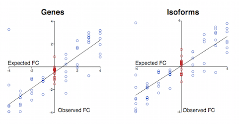
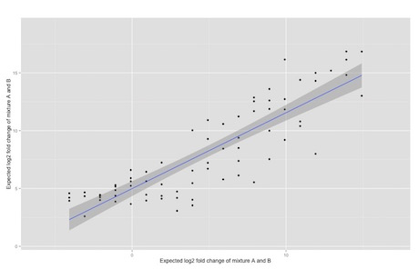

Introduction
---

An accurate quantification of variability in RNA sequencing analysis is critical for bioinformatics analysis. To control for these sources of variabiltiy, [Garvan Institute of Medical Research](www.garvan.org.au) has developed a set of spiked-in synthetic sequins known as TransQuin. The sequins emulate a diverse range of genomic features and they are combined together across a range of concentration to formulate a mixture to emulate quantitative features.    

Anaquin is a statistical software toolkit built for TransQuin. It is designed to analyze outputs generated by the NGS tools, and accommodates the analysis with detailed statistics on the sequins. Please refer to [www.sequin.xyz](www.sequin.xyz) for more details.

Data
---

_Homo spaiens_ melanoma cell lines (Hs): These human data correspond to a comparison between a melanoma cell line expressing the Microphtalmia Transcription Factor (MiTF) and a melanoma cell line in which small interfering RNAs (siRNAs) are used against MiTF in order to lower its expression.

_Mus musculus_ muscle stem cells (Mm): These data are related to a transcriptome study where the expression of miRNAs was measured in three different cellular stages of the skeletal muscel lineage in adult mouse.

Mixture
---

The range of RNA abundance in TransQuin Mix 1 and Mix 2 is used to assess the dynamic range of an experiment. The experiment has a dynamic range and the reference sample RNA-Seq experiment dynamic range spans the design dynamic range. This difference is because of increased sequencing depth in the reference sample experiment. Note that the observed TransQuin control signal-abundance relationship is intended for qualitative assessment of dynamic range. The ERCC controls, as used in these differential gene expression experiments, are not recommended for chemical calibration. The mRNA-enchrichment process, in particular ploy-A selection, can bias the expected signal-abundance relationship of ERCC controls, which have ploy-A tails ranging from ~20 to 26nt, significantly shorter than endogenous transcript ploy-A tails.

Methods
---

The datasets included in this study were obtained from two different Illumina sequencing machines, differing in their read length and overall throughput but sharing the same sequencing technology that takes place on a glass slide called a 'flow cell'. A flow cell is made up of eight independent sequencing areas, or 'lanes'. Libraries are deposited on these lanes in order to be sequenced. A library contains cDNAs representative of the RNA molecules that are extracted form a given culture or tissue and are pre-processed in order to be adapted to the sequencing procedire. Simularly to microarrays, the library composition reflects the RNA repertoire expressed in the corresponding culture or tissue. The 'library size' refers to the number of mapped short reads obtained from the sequencing process of the library. In this study, a single library was sequenced in each lane.

Expression Analysis
---

Out of `160` sequins, 150 of them have been detected. 





The observed TransQuin known-measured relationship is intended for qualitative assessment of dynamic range. A linear regression and it's 95% confidence interval is also plotted.


```{r, echo=FALSE, message=FALSE, warnings=FALSE}

x   <- c(1.888275, 0.944138, 483.398438, 15.106201, 60.424803, 7734.375000, 241.699219, 30.212402, 15.106201, 30.212402, 1933.593750, 3.776550, 0.059009, 3867.187424, 966.796875, 1933.593750, 120.849609, 15.106201, 241.699219, 0.944138, 0.944138, 15468.749695, 15468.750000, 0.118017, 241.699219, 120.849609, 3867.187500, 120.849609, 7.553101, 120.849609, 483.398438, 15.106201, 7.553101, 483.398438, 1.888275, 60.424805, 30937.501465, 241.699219, 1.888275, 30.212402, 0.472069, 1933.593750, 15468.750000, 483.398438, 30.212402, 15.106201, 30937.500000, 0.944138, 1.888275, 7.553101, 0.118017, 0.059009, 0.236034, 60.424805, 0.472069, 0.472069, 0.236034, 966.796875, 0.118017, 483.398438, 0.944138, 0.472069, 3867.187424, 120.849607, 966.796875, 3.776550, 0.236034, 0.236034, 966.796875, 3.776550, 0.059009, 3.776550, 0.472069)
y   <- c(86.948600, 96.745000, 3758.170000, 1047.790000, 55.169400, 37407.900000, 3300.120000, 622.477000, 93.213000, 1931.880000, 1347.260000, 150.979000, 15.291200, 32651.300000, 72767.000000, 1778.630000, 2401.030000, 16.294400, 46.419400, 37.670300, 12.636600, 28808.500000, 117754.000000, 20.118800, 7491.470000, 362.366000, 20204.100000, 167.120000, 18.230800, 667.599000, 185.609000, 11.608000, 8.385230, 1019.990000, 49.321800, 347.963000, 117035.000000, 5955.880000, 15.483600, 149.082000, 29.018600, 21487.600000, 72072.400000, 12446.100000, 104.500000, 44.028500, 8276.940000, 48.998700, 22.042000, 26.603200, 6.039840, 23.970400, 15.998700, 1530.130000, 36.039300, 39.259000, 20.760100, 588.915000, 25.234100, 6244.650000, 59.636800, 14.562000, 255.073000, 69.996900, 6775.150000, 17.383300, 21.860800, 18.929000, 3667.450000, 40.991600, 18.488000, 20.520900, 20.789300)
ids <- c('R1_101','R1_102','R1_103','R1_11','R1_12','R1_13','R1_14','R1_22','R1_23','R1_24','R1_31','R1_32','R1_33','R1_41','R1_42','R1_43','R1_51','R1_52','R1_53','R1_61','R1_62','R1_63','R1_71','R1_72','R1_73','R1_81','R1_82','R1_83','R1_91','R1_92','R1_93','R2_1','R2_105','R2_115','R2_116','R2_117','R2_14','R2_150','R2_151','R2_152','R2_153','R2_154','R2_18','R2_19','R2_20','R2_24','R2_26','R2_27','R2_28','R2_32','R2_33','R2_37','R2_38','R2_41','R2_42','R2_45','R2_46','R2_47','R2_53','R2_54','R2_57','R2_59','R2_6','R2_60','R2_63','R2_65','R2_67','R2_68','R2_7','R2_71','R2_72','R2_73','R2_76')

lx <- log2(x)
ly <- log2(y)

summary(lm(ly~lx))
```

\newpage

Differential Analysis
---



```{r, echo=FALSE, message=FALSE, warnings=FALSE}

x   <- c(1.888275, 0.944138, 483.398438, 15.106201, 60.424803, 7734.375000, 241.699219, 30.212402, 15.106201, 30.212402, 1933.593750, 3.776550, 0.059009, 3867.187424, 966.796875, 1933.593750, 120.849609, 15.106201, 241.699219, 0.944138, 0.944138, 15468.749695, 15468.750000, 0.118017, 241.699219, 120.849609, 3867.187500, 120.849609, 7.553101, 120.849609, 483.398438, 15.106201, 7.553101, 483.398438, 1.888275, 60.424805, 30937.501465, 241.699219, 1.888275, 30.212402, 0.472069, 1933.593750, 15468.750000, 483.398438, 30.212402, 15.106201, 30937.500000, 0.944138, 1.888275, 7.553101, 0.118017, 0.059009, 0.236034, 60.424805, 0.472069, 0.472069, 0.236034, 966.796875, 0.118017, 483.398438, 0.944138, 0.472069, 3867.187424, 120.849607, 966.796875, 3.776550, 0.236034, 0.236034, 966.796875, 3.776550, 0.059009, 3.776550, 0.472069)
y   <- c(86.948600, 96.745000, 3758.170000, 1047.790000, 55.169400, 37407.900000, 3300.120000, 622.477000, 93.213000, 1931.880000, 1347.260000, 150.979000, 15.291200, 32651.300000, 72767.000000, 1778.630000, 2401.030000, 16.294400, 46.419400, 37.670300, 12.636600, 28808.500000, 117754.000000, 20.118800, 7491.470000, 362.366000, 20204.100000, 167.120000, 18.230800, 667.599000, 185.609000, 11.608000, 8.385230, 1019.990000, 49.321800, 347.963000, 117035.000000, 5955.880000, 15.483600, 149.082000, 29.018600, 21487.600000, 72072.400000, 12446.100000, 104.500000, 44.028500, 8276.940000, 48.998700, 22.042000, 26.603200, 6.039840, 23.970400, 15.998700, 1530.130000, 36.039300, 39.259000, 20.760100, 588.915000, 25.234100, 6244.650000, 59.636800, 14.562000, 255.073000, 69.996900, 6775.150000, 17.383300, 21.860800, 18.929000, 3667.450000, 40.991600, 18.488000, 20.520900, 20.789300)
ids <- c('R1_101','R1_102','R1_103','R1_11','R1_12','R1_13','R1_14','R1_22','R1_23','R1_24','R1_31','R1_32','R1_33','R1_41','R1_42','R1_43','R1_51','R1_52','R1_53','R1_61','R1_62','R1_63','R1_71','R1_72','R1_73','R1_81','R1_82','R1_83','R1_91','R1_92','R1_93','R2_1','R2_105','R2_115','R2_116','R2_117','R2_14','R2_150','R2_151','R2_152','R2_153','R2_154','R2_18','R2_19','R2_20','R2_24','R2_26','R2_27','R2_28','R2_32','R2_33','R2_37','R2_38','R2_41','R2_42','R2_45','R2_46','R2_47','R2_53','R2_54','R2_57','R2_59','R2_6','R2_60','R2_63','R2_65','R2_67','R2_68','R2_7','R2_71','R2_72','R2_73','R2_76')

lx <- log2(x)
ly <- log2(y)

summary(lm(ly~lx))
```

\newpage

Apprendix
---

Density plot for _R2_14_1_


