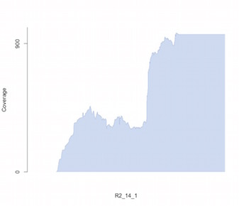
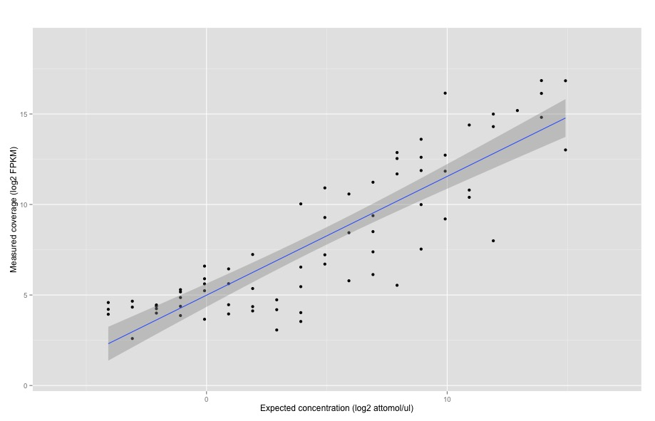

# Read Alignment

```{r eval=FALSE}
Summary for dataset: K_RMXA1v2.accepted_hits.sorted.bam

   Unmapped:   0 reads
   Experiment: 36484961 (76.13%) reads
   Synthetic:  11440146 (23.87%) reads

   Reference:  1190 exons
   Reference:  1028 introns
   Reference:  149219 bases

   Query:      84739030 exons
   Query:      27056077 introns
   Query:      153438 bases

   Dilution:   0.238709

   ***
   *** The following statistics are computed at the exon, intron and base level.
   ***
   *** Exon level is defined by performance per exon. An alignment that
   *** is not mapped entirely within an exon is considered as a FP. The
   *** intron level is similar.
   ***
   *** Base level is defined by performance per nucleotide. A partial
   *** mapped read will have FP and TP.
   ***

   -------------------- Exon level --------------------

   Sensitivity: 0.997479
   Specificity: 0.984404
   Detection:   0.0590086 (R2_33)

   -------------------- Intron level --------------------

   Sensitivity: 0.993191
   Specificity: 1
   Detection:   0.0590086 (R2_33)

   -------------------- Base level --------------------

   Sensitivity: 0.703341
   Specificity: 1
   Detection:   0.0590086 (R2_33)
```

# Transctiptome Assembly

```{r eval=FALSE}
Summary for dataset: transcripts.gtf

   Experiment: 1897 features
   Synthetic:  799 features

   Reference:  162 exons
   Reference:  1028 introns

   ***
   *** The following statistics are computed for exact and fuzzy.
   ***
   *** The fuzzy level is 10 nucleotides.
   ***

   -------------------- Exon level --------------------

   Sensitivity: 0.547018 (0.566514)
   Specificity: 0.952096 (0.986028)
   Detection:   0.015736 (R2_72_1)

   -------------------- Intron level --------------------

   Sensitivity: 0.521164 (0.52381)
   Specificity: 0.987469 (0.992481)
   Detection:   0.015736 (R2_72_1)

   -------------------- Base level --------------------

   Sensitivity: 0.570883
   Specificity: 0.906859
   Detection:   0.472069 (R2_28)

   -------------------- Intron Chain level --------------------

   Sensitivity: 0.394904 (0.414013)
   Specificity: 0.681319 (0.714286)

   -------------------- Transcript level --------------------

   Sensitivity: 0.393939 (0.393939)
   Specificity: 0.555556 (0.555556)

   Missing exons: 385/872 (0.441514)
   Missing introns: 324/756 (0.428571)

   Novel exons: 23/501 (0.0459082)
   Novel introns: 1/399 (0.00250627)
```

# Expression Analysis (Genes)

```{r eval=FALSE}
Summary for dataset: stringout_sub0.01_guided_B/stringout_sub0.01_guided_genes.txt

   Experiment:  601 genes
   Synthetic:   68 genes

   Reference:   76 genes
   Detected:    68 genes

   ***
   *** Detection Limits
   ***

   Absolute:    0.0590086 (attomol/ul) (R2_33)

   Correlation: 0.951391
   Slope:       5.17238
   R2:          0.905145
   F-statistic: 610.716
   P-value:     0
   SSM:         8.78529e+10, DF: 1
   SSE:         9.20654e+09, DF: 64
   SST:         9.70595e+10, DF: 65

   ***
   *** The following statistics are computed on the log2 scale.
   ***
   ***   Eg: If the data points are (1,1), (2,2). The correlation will
   ***       be computed on (log2(1), log2(1)), (log2(2), log2(2)))
   ***

   Correlation: 0.960584
   Slope:       0.944504
   R2:          0.922722
   F-statistic: 764.178
   P-value:     0
   SSM:         1518.12, DF: 1
   SSE:         127.143, DF: 64
   SST:         1645.26, DF: 65
```



\pagebreak
# Expression Analysis (Isoforms)

```{r eval=FALSE}
Summary for dataset: stringout_sub0.01_guided_B/t_data.ctab

   Experiment:  0 isoforms
   Synthetic:   164 isoforms

   Reference:   162 isoforms
   Detected:    162 isoforms

   ***
   *** Detection Limits
   ***

   Absolute:    0.00393391 (attomol/ul) (R2_38_1)

   Correlation: 0.945312
   Slope:       5.26846
   R2:          0.893614
   F-statistic: 520.784
   P-value:     0
   SSM:         7.01119e+10, DF: 1
   SSE:         8.34691e+09, DF: 62
   SST:         7.84588e+10, DF: 63

   ***
   *** The following statistics are computed on the log2 scale.
   ***
   ***   Eg: If the data points are (1,1), (2,2). The correlation will
   ***       be computed on (log2(1), log2(1)), (log2(2), log2(2)))
   ***

   Correlation: 0.927843
   Slope:       0.894364
   R2:          0.860892
   F-statistic: 383.697
   P-value:     0
   SSM:         783.229, DF: 1
   SSE:         126.559, DF: 62
   SST:         909.787, DF: 63
```



\pagebreak

# Differential Analysis


