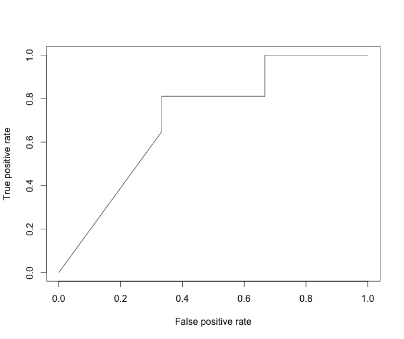
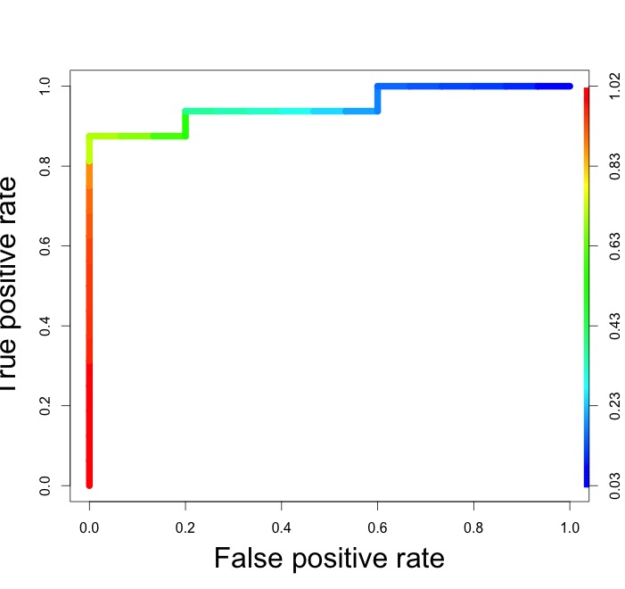
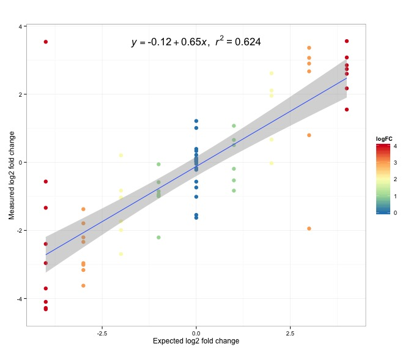
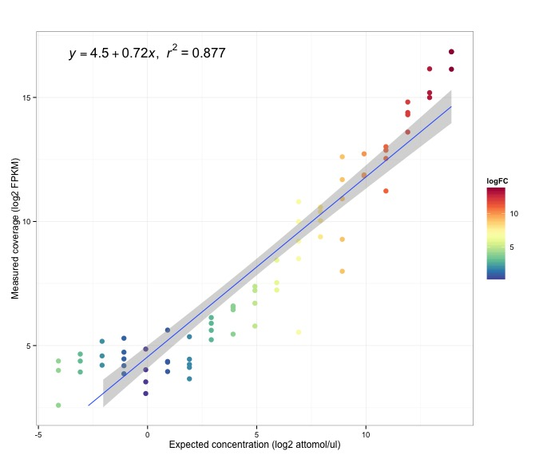

Header 1
---------------

ssdasd

Header 2
---------------


# Read Alignment for accepted_hits.bam (A1)

```{r eval=FALSE}
Summary for dataset: A1/TransAlign_summary.stats

   Unmapped:   0 reads
   Experiment: 6635268 (21.5363%) reads
   Synthetic:  24174356 (78.4637%) reads

   Reference:  1190 exons
   Reference:  1028 introns
   Reference:  149219 bases

   Query:      59421555 exons
   Query:      24855847 introns
   Query:      163383 bases

   Dilution:   0.784637

   ***
   *** The following statistics are computed at the exon, intron and base level.
   ***
   *** Exon level is defined by performance per exon. An alignment that
   *** is not mapped entirely within an exon is considered as a FP. The
   *** intron level is similar.
   ***
   *** Base level is defined by performance per nucleotide. A partial
   *** mapped read will have FP and TP.
   ***

   -------------------- Exon level --------------------

   Sensitivity: 0.994958
   Specificity: 0.973343
   Detection:   0.0590086 (R2_33)

   -------------------- Intron level --------------------

   Sensitivity: 0.991245
   Specificity: 0.821653
   Detection:   0.0590086 (R2_33)

   -------------------- Base level --------------------

   Sensitivity: 0.692468
   Specificity: 0.924613
   Detection:   0.0590086 (R2_33)

   -------------------- Undetected --------------------

   Exon:   0.005042
   Intron: 0.008755
   Gene:   0.052632
```

\pagebreak

# Read Alignment for accepted_hits.bam (A2)

```{r eval=FALSE}
Summary for dataset: A2/TransAlign_summary.stats

   Unmapped:   0 reads
   Experiment: 5742035 (20.4187%) reads
   Synthetic:  22379420 (79.5813%) reads

   Reference:  1190 exons
   Reference:  1028 introns
   Reference:  149219 bases

   Query:      55184443 exons
   Query:      24887760 introns
   Query:      163986 bases

   Dilution:   0.795813

   ***
   *** The following statistics are computed at the exon, intron and base level.
   ***
   *** Exon level is defined by performance per exon. An alignment that
   *** is not mapped entirely within an exon is considered as a FP. The
   *** intron level is similar.
   ***
   *** Base level is defined by performance per nucleotide. A partial
   *** mapped read will have FP and TP.
   ***

   -------------------- Exon level --------------------

   Sensitivity: 0.996639
   Specificity: 0.975178
   Detection:   0.0590086 (R2_33)

   -------------------- Intron level --------------------

   Sensitivity: 0.991245
   Specificity: 0.763722
   Detection:   0.0590086 (R2_33)

   -------------------- Base level --------------------

   Sensitivity: 0.693059
   Specificity: 0.921999
   Detection:   0.0590086 (R2_33)

   -------------------- Undetected --------------------

   Exon:   0.003361
   Intron: 0.008755
   Gene:   0.039474
```

\pagebreak

# Read Alignment for accepted_hits.bam (A3)

```{r eval=FALSE}
Summary for dataset: A3/TransAlign_summary.stats

   Unmapped:   0 reads
   Experiment: 5803436 (21.0203%) reads
   Synthetic:  21805238 (78.9797%) reads

   Reference:  1190 exons
   Reference:  1028 introns
   Reference:  149219 bases

   Query:      53748651 exons
   Query:      22830699 introns
   Query:      166153 bases

   Dilution:   0.789797

   ***
   *** The following statistics are computed at the exon, intron and base level.
   ***
   *** Exon level is defined by performance per exon. An alignment that
   *** is not mapped entirely within an exon is considered as a FP. The
   *** intron level is similar.
   ***
   *** Base level is defined by performance per nucleotide. A partial
   *** mapped read will have FP and TP.
   ***

   -------------------- Exon level --------------------

   Sensitivity: 0.996639
   Specificity: 0.974466
   Detection:   0.0590086 (R2_33)

   -------------------- Intron level --------------------

   Sensitivity: 0.992218
   Specificity: 0.811167
   Detection:   0.0590086 (R2_33)

   -------------------- Base level --------------------

   Sensitivity: 0.695741
   Specificity: 0.913495
   Detection:   0.0590086 (R2_33)

   -------------------- Undetected --------------------

   Exon:   0.003361
   Intron: 0.007782
   Gene:   0.039474
```

\pagebreak

# Read Alignment for accepted_hits.bam (B1)

```{r eval=FALSE}
Summary for dataset: B1/TransAlign_summary.stats

   Unmapped:   0 reads
   Experiment: 3564555 (14.1897%) reads
   Synthetic:  21556180 (85.8103%) reads

   Reference:  1190 exons
   Reference:  1028 introns
   Reference:  149219 bases

   Query:      57069428 exons
   Query:      26914113 introns
   Query:      158601 bases

   Dilution:   0.858103

   ***
   *** The following statistics are computed at the exon, intron and base level.
   ***
   *** Exon level is defined by performance per exon. An alignment that
   *** is not mapped entirely within an exon is considered as a FP. The
   *** intron level is similar.
   ***
   *** Base level is defined by performance per nucleotide. A partial
   *** mapped read will have FP and TP.
   ***

   -------------------- Exon level --------------------

   Sensitivity: 0.992437
   Specificity: 0.981463
   Detection:   0.0590086 (R2_33)

   -------------------- Intron level --------------------

   Sensitivity: 0.986381
   Specificity: 0.880564
   Detection:   1.88828 (R1_72)

   -------------------- Base level --------------------

   Sensitivity: 0.685079
   Specificity: 0.942327
   Detection:   0.0590086 (R2_33)

   -------------------- Undetected --------------------

   Exon:   0.007563
   Intron: 0.013619
   Gene:   0.065789
```

\pagebreak

# Read Alignment for accepted_hits.bam (B2)

```{r eval=FALSE}
Summary for dataset: B2/TransAlign_summary.stats

   Unmapped:   0 reads
   Experiment: 3673262 (14.5259%) reads
   Synthetic:  21614486 (85.4741%) reads

   Reference:  1190 exons
   Reference:  1028 introns
   Reference:  149219 bases

   Query:      57264502 exons
   Query:      28885125 introns
   Query:      160649 bases

   Dilution:   0.854741

   ***
   *** The following statistics are computed at the exon, intron and base level.
   ***
   *** Exon level is defined by performance per exon. An alignment that
   *** is not mapped entirely within an exon is considered as a FP. The
   *** intron level is similar.
   ***
   *** Base level is defined by performance per nucleotide. A partial
   *** mapped read will have FP and TP.
   ***

   -------------------- Exon level --------------------

   Sensitivity: 0.994118
   Specificity: 0.981653
   Detection:   0.0590086 (R2_33)

   -------------------- Intron level --------------------

   Sensitivity: 0.984436
   Specificity: 0.818059
   Detection:   0.0590086 (R2_33)

   -------------------- Base level --------------------

   Sensitivity: 0.687879
   Specificity: 0.934117
   Detection:   0.0590086 (R2_33)

   -------------------- Undetected --------------------

   Exon:   0.005882
   Intron: 0.015564
   Gene:   0.052632
```

\pagebreak

# Read Alignment for accepted_hits.bam (B3)

```{r eval=FALSE}
Summary for dataset: B3/TransAlign_summary.stats

   Unmapped:   0 reads
   Experiment: 4705904 (15.6992%) reads
   Synthetic:  25269549 (84.3008%) reads

   Reference:  1190 exons
   Reference:  1028 introns
   Reference:  149219 bases

   Query:      67685272 exons
   Query:      37139930 introns
   Query:      162712 bases

   Dilution:   0.843008

   ***
   *** The following statistics are computed at the exon, intron and base level.
   ***
   *** Exon level is defined by performance per exon. An alignment that
   *** is not mapped entirely within an exon is considered as a FP. The
   *** intron level is similar.
   ***
   *** Base level is defined by performance per nucleotide. A partial
   *** mapped read will have FP and TP.
   ***

   -------------------- Exon level --------------------

   Sensitivity: 0.994958
   Specificity: 0.980831
   Detection:   0.0590086 (R2_33)

   -------------------- Intron level --------------------

   Sensitivity: 0.986381
   Specificity: 0.759454
   Detection:   0.0590086 (R2_33)

   -------------------- Base level --------------------

   Sensitivity: 0.688292
   Specificity: 0.922827
   Detection:   0.0590086 (R2_33)

   -------------------- Undetected --------------------

   Exon:   0.005042
   Intron: 0.013619
   Gene:   0.052632
```

\pagebreak

```
Summary for dataset: /Users/tedwong/Desktop/K_562/Cuffdiffs/gene_exp.diff

   Experiment:  9682 genes
   Synthetic:   67 genes

   Reference:   76 genes
   Detected:    65 genes

   ***
   *** Statistics for linear regression
   ***

   Correlation: 0.56272
   Slope:       0.411349
   R2:          0.316654
   F-statistic: 29.1934
   P-value:     1.06667e-06
   SSM:         244.21, DF: 1
   SSE:         527.011, DF: 63
   SST:         771.221, DF: 64

   ***
   *** Statistics for linear regression (log2 scale)
   ***

   Correlation: 0.769414
   Slope:       0.545994
   R2:          0.591998
   F-statistic: 91.4108
   P-value:     7.00551e-14
   SSM:         116.382, DF: 1
   SSE:         80.21, DF: 63
   SST:         196.592, DF: 64
```






\pagebreak

```
Summary for dataset: /Users/tedwong/Desktop/K_562/Cufflinks/A1/genes.fpkm_tracking

   Experiment:  60570 gene
   Synthetic:   75 gene

   Reference:   76 gene
   Detected:    4.39067 gene

   ***
   *** Detection Limits
   ***

   Break: 3.77655 (R1_62)

   Left:  4.39067 + 0.0805742x (R2 = 0.0567335)
   Right: 2.0794 + 1.00352x (R2 = 0.922502)

   ***
   *** Statistics for linear regression
   ***

   Correlation: 0.962825
   Slope:       6.46625
   R2:          0.927032
   F-statistic: 902.032
   P-value:     0
   SSM:         3.50824e+10, DF: 1
   SSE:         2.76138e+09, DF: 71
   SST:         3.78438e+10, DF: 72

   ***
   *** Statistics for linear regression (log2 scale)
   ***

   Correlation: 0.936306
   Slope:       0.724913
   R2:          0.876669
   F-statistic: 504.686
   P-value:     0
   SSM:         1040.46, DF: 1
   SSE:         146.373, DF: 71
   SST:         1186.83, DF: 72
```


