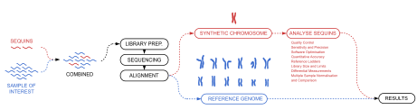
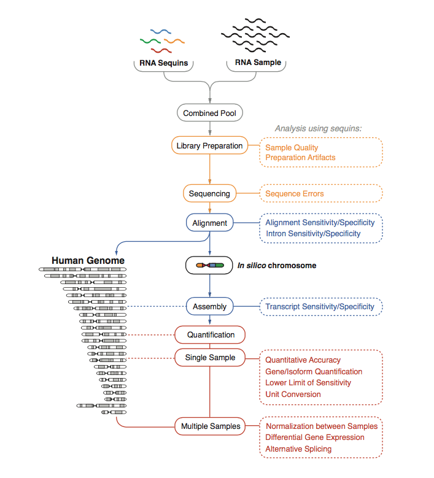
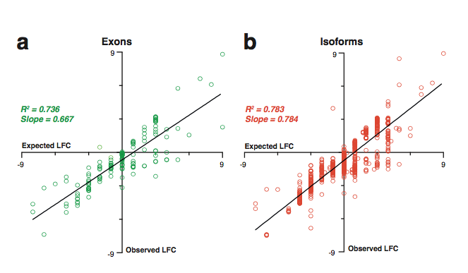
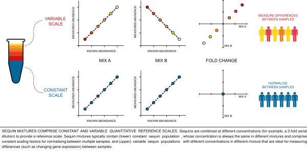
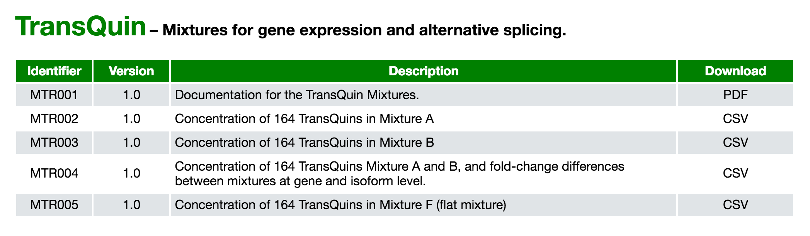
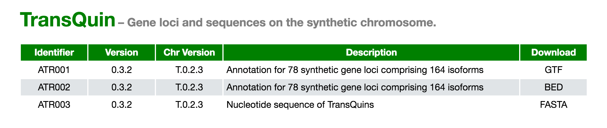

\newpage

# Introduction

## Project

The project is lead by Dr Timothy Mercer who conceived the project and applied the funding with Australian National Health and Medical Research Council (NHMRC). The contents of the published material are solely the responsibility of Garvan Institute of Medical Research and do not reflect the views of NHMRC.

Garvan Institute is one of Australia's largest medical research institutions. Its mission as being *"...to make significant contributions to medical research that will change the directions of science and medicine and have major impacts on human health. Garvan strives to enhance and develop research programs that combine fundamental science with strong clinical interactions."*

## Citation

  - *Spliced synthetic genes as internal controls in RNA sequencing experiments* - S.A Hardwick (2016)
  - *Representing genetic variation with synthetic DNA standards* - I.W Deveson (2016)

## How to get help

Most questions about Anaquin will hopefully be answered by the documentation or references. There is also a website at www.sequin.xyz. If you've run into a question which isn't addressed by the documentation. or you've found a conflict between the documentation and software itself, then there is a nactive support community that can offer help.

The Anaquin authors always appreciate receiving reports of bugs in the software or in the documentation. The same goes for well-considered suggestions for improvements. All other questions or problems concerning Anaquin should be emailed to t.mercer@garvan.org.au.

Note that each command-line tool and R-function has its own online help page at www.sequin.xyz. If you have a question about any particular tool or function, reading the online documentation will often answer the question very quickly.

\newpage

# Overview

## Sequins

Next-generation sequencing (NGS) enables rapid, cheap and high-throughput determination of DNA (or RNA) sequences within a user’s sample. NGS methods have been applied widely, and have fuelled major advances in the life sciences and clinical health care over the past decade. However, NGS typically generates a large amount of sequencing data that must be first analyzed and interpreted with bioinformatic tools. There is no standard way to perform an analysis of NGS data; different tools provide different advantages in different situations. For example, the tools for finding small deletions in the human genome are different to the tools to find large deletions. The sheer number, complexity and variation of sequences further compound this problem, and there is little reference by which compare next-generation sequencing and analysis.

To address this problem, we have developed a suite of synthetic nucleic-acid standards that we term sequins (sequencing spike-ins). Sequins represent genetic features, such as genes, large structural rearrangements, that are often analyzed with NGS. However, whilst sequins may act like a natural genetic feature, their primary sequence is artificial, with no extended homology to natural genetic sequences. Sequins are fractionally added to the extracted nucleic-acid sample prior to library preparation, so they are sequenced along with your sample of interest (see Figure 1). The reads that derive from sequins can be identified by their artificial sequences that prevent their cross-alignment to the genome of known organisms.

Rather than aligning to natural genomes, the sequin read align to a synthetic chromosome sequence. The synthetic chromosome is an in silico sequence that exists only on your computer, however, the synthetic chromosome sequence contains all the features of a chromosome. For example, an artificial human chromosome includes genes, repeats, telomeres and centromeres. Despite these features, the primary sequence of the artificial chromosome has no homology to natural genetic sequences, and can therefore be used simultaneously with a natural reference genome during read alignment and analysis.



Sequencing spike-ins are added to your DNA/RNA sample at a fractional concentration (typically 1%) prior to library preparation and sequencing. The sequin reads have no homology to any natural sequence, and do not align to any natural genome, but rather to a synthetic chromosome whilst the normal reads align to your reference genome. We can use the sequins as an internal quantitative and qualitative control to assess any stage of the next-generation sequencing workflow and inform intrpretation of results.



\newpage

## Motivation

Sequins can help us:

  - Derive the normalization factor for RNA experiement. It serves as negative controls that can be spiked independently with the sample.
  
  - Quantification *without* time-consuming alignment, by building k-mers index for the sequins
  
  - Validate the accuracy of differential gene analysis. Furthermore, differential analysis at the isoform and exon level are possible. 
  
  - Check the accuracy of somatic mutations, for example, the lowest allele frequency your experiment can still accurately quantify
  
  - Construct an receiver operating characteristic (ROC) plot that tabluates the sensitivty
  
  
  - Determine the empharical limit of quantification, below which the measurement becomes increasingly stochastic
  
  
  - Validate structual variations, for example, repeats, inversions, copy-number variation and translocations etc.

## Mixture

Sequins are combined together across a range of concentrations to formulate a mixture. The benefits of mixtures are two-fold;

   - **Mixtures can emulate quantitative features of genome biology.** For example, by modulating the relative abundance of different RNA sequins to represent alternative isoforms spliced from a single gene loci, we can emulate the biological process of alternative splicing. Similarly, by modulating the relative abundance of sequins that represent alternative genetic variants, we can emulate a range of homozygous (wherein only one sequin is present), heterozygous (wherein two sequins are present at equal concentration) genotypes. More complex scenarios can be similarly emulated by modulating the relative abundance of alternative sequin variants, such as representing somatic mutations in an impure sample containing only a fraction of tumour cells, or representing a fetal genotype against the from maternal genotype background in circulating DNA.

   - **Mixtures can provide internal quantitative ladders to measure the abundance of genetic features within and between samples.** Sequins can be combined at sequential concentrations across a wide dynamic range to establish a quantities ladder. This ladder provides an internal scale against which to measure many features of the sequencing library, including the abundance of sequences in the accompanying sample, the conversion from read abundance into units of molar concentration and to assess library depth, complexity and linearity.
Sequencing coverage is one of the most critical variables in identifying and analysing a genome feature, whether it be assembling the structure of a novel isoform, or confidently identifying a variant. By scaling sequins across a ladder of concentrations, we are also able to assess the impact of different sequencing coverage on the analysis of features in the accompanying genetic sample.
Reference scales can also be used to measure differences and similarities between multiple samples. Typically, multiple alternative mixtures are formulated that are each comprised of two parts:

     - An invariant subset of sequins that do not vary between the multiple mixtures The invariant sequins comprise a comprise a common framework of scaling factors by which to perform quantitative normalisation between multiple samples (to which the alternative ). For example, they can be used to calibrate sequence coverage between matched tumour and normal genome sequencing, normalisation between RNA sample replicates or between different metagenome communities.
     - A variable subset of sequins that vary in concentration between multiple mixture formulations. These variable sequins establish a scale of changing abundance between mixtures, and can be used to measure differences between multiple samples, such as differential gene expression of allele frequency.



\newpage

# Anaquin

## Overview

Anaquin is both a command-line tool and R-bioconductor package. Most of the statistical analysis is done by command-line, but data visualization is handled by R. The typical workflow consists of generation of statistical results, including ready-to-use R scripts.

The R-package can also be used indepdnently:

The following NGS analysis is supported:

  - Transcriptome analyis
  - Variant analysis
  - Metagenomic analysis
  - Fusion analysis
  - Ladder analysis

## Mixture file

In Anaquin, mixture is specified by a text file listing the input concentration for each sequin. You can browse the mixture files at www.sequin.xyz.



The format is tab-delimiated CSV, and it can be loaded by a text-editor:

```{}
$ wget https://s3.amazonaws.com/anaquin/mixtures/MTR002.v013.csv
$ head MTR002.v013.csv

ID	         Length	      MXA (attomol/ul)
R1_11_1	     703  	      161.1328125
R1_11_2	     785	      80.56640625
R1_13_1	     1940	      5156.25
R1_13_2	     698	      2578.125
```

You will need to choose the right mixture file for your experiment. Anaquin performs statistical analysis based on the input concentration specified by the mixture file.

## Annotation file

Anaquin requires annotation for the synthetic chromosome to perform statistical analysis. Some examples:

  - Coordinates of the exons and introns
  - Reference and variant alleles 
  - Fusion breakpoint

Different analysis requires different annotation, so it is important to read the documentation carefully. You can browse the annotation files at www.sequin.xyz.



## Tools

Collectively, Anaquin is a collection of utilities for a wide-range of genomics analysis tasks with sequins. Most of the tools require:

  - Mixture file
  - Reference annotation
  - User generated files
  
to run an analysis. For example, **VarAllele** allows one to validate the sensitivity for a range of allele frequencies. This would require:

  - Mixture file for the input (or expected) allele frequency for each sequin
  - Reference annoation of where the SNPs are
  - Use generated VCF file by a bioinformatic software (such as VarScan)
  
The command to run the analysis would look like:

```{}
anaquin -t VarAllele -soft gatk -m MVA011.v013.csv -rvcf AVA009.v032.vcf -ufiles variant.vcf
```

  - **-t** gives the name of the tool
  - **-soft** gives the name of the software generated the VCF file
  - **-m** gives the file name of the mixture
  - **-rvcf** gives the file name of the reference annotation which is a VCF file
  - **-ufiles** gives the file name of the generated VCF file
  
Please note *-ufiles* is the only option varies by each experiment. Users should not need to modify the mixture and the annotation file.

Anaquin support the following tools for transcriptome analysis:

  - *TransAlign*
  - *TransAssembly*
  - *TransExpress*
  - *TransKExpress*
  - *TransDiff*
  - *TransKDiff*
  - *TransIGV*
  - *TransCoverage*

Variant analysis:

  - *VarAlign*
  - *VarDiscovery*
  - *VarAllele*
  - *VarKAllele*
  - *VarExpress*
  - *VarKExpress*
  - *VarIGV*
  - *VarSubsample*
  - *VarCoverage*
  
Fusion analysis:

  - *FusDiscover*
  - *FusExpress*
  - *FusNormal*
  - *FusIGV*
  - *FusCoverage*
  
 Metagenomic analysis:
 
  - *MetaAssembly*
  - *MetaExpress*
  - *MetaIGV*
  - *MetaDiff*
  - *MetaCoverage*
  
 Ladder analysis:
 
   - *LadExpress*
   - *LadCoverage*
   - *LadDiff*

Please read the online documentation for more details.

\newpage

# TransQuin
## Overview

Human genes are typically encoded as smaller component exon sequences interspersed between long intervening intron. Following transcription, the introns are removed during splicing to generate a mature mRNA isoform. The alternative splicing of exons can generate a diverse range of isoforms from a single gene loci. The pervasive transcription of the human gene loci generates a transcriptome with huge and complex scale.

RNA sequencing (RNAseq) has the ability to both reconstruct complex spliced isoforms by the across splice junctions whilst simultaneously measuring gene or isoform expression. Accordingly, RNAseq can provide a global profile of the transcriptome within a cell, tissue or developmental stage.

However, the sheer size and complexity of the human transcriptome can confound transcriptome analysis with RNAseq. The wide dynamic range between high- and low-expressed genes limits the sequencing coverage of most genes, with only sparse coverage of lowly expressed genes that prevents the full assembly of transcripts and results in variable sampling and quantification.

The accurate alignment of reads across large intron junctions, repetitive DNA sequences and small exons can be difficult, preventing the accurate assembly of alternative-spliced isoform structures. Numerous biases during the RNAseq workflow, including RNA extraction, ribosomal RNA depletion, library preparation, sequencing and analysis further confound the accurate measurement of gene and isoform expression.

We have developed a set of RNA sequins that we term TransQuins (transcriptome sequencing spike-ins) for use with RNA sequencing experiments. TransQuins enable users to improve the qualitative and quantitative analysis of their RNAseq workflow.

## Sample data set


## Aligning reads to a genome


## Producing a table of read counts
## Reading the counts from a file
## Running DESeq2
## Validating DESeq2
## Running edgeR
## Validating edgeR
## Running Sleuth
## Validating Sleuth

\newpage

# VarQuin
## Overview
## Aligning reads to a genome
## Running GATK
## Validating GATK
## Running VarScan
## Validating VarScan
## Running Kallisto
## Validating Kallisto

\newpage

# FusQuin
## Aligning reads to a genome
## Running Tophat-Star
## Validating Tophat-Fusion
## Running Star-Fusion
## Validating Star-Fusion

\newpage

# MetaQuin
## Running Velvet
## Validating Velvet
## Running RayMeta
## Validating RayMeta

\newpage

# LadQuin
## Looking for CNV
## Validating CNV
